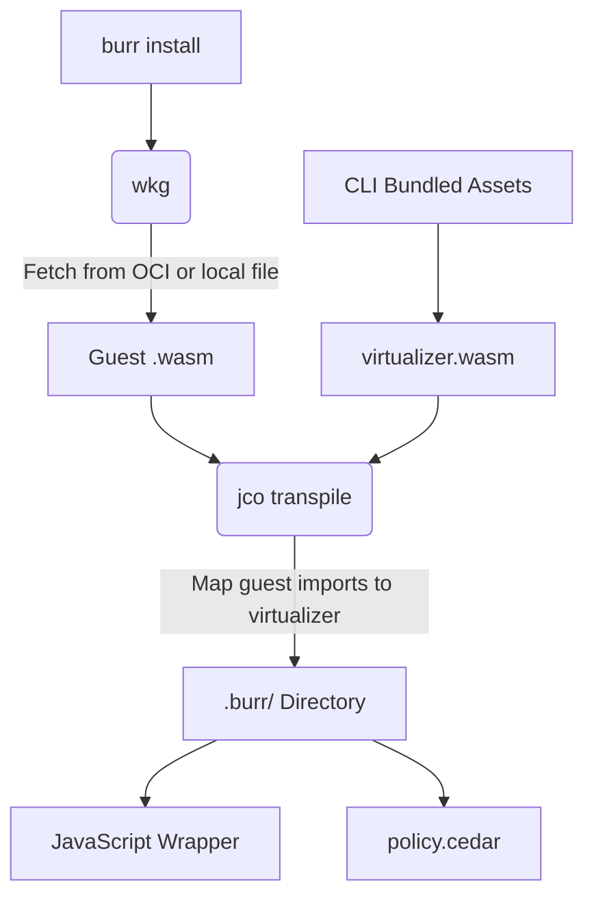
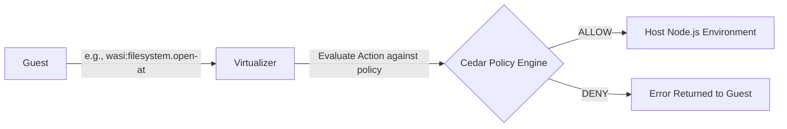

# Architecture Overview

`burr` acts as an intercepting proxy for WebAssembly Component Model modules, leveraging WASI 0.3 interfaces to securely manage system capabilities.

## References
- [WASI 0.3 and the WebAssembly Component Model](https://component-model.bytecodealliance.org/introduction.html)
- [wit-bindgen Documentation](https://docs.rs/wit-bindgen/latest/wit_bindgen/)
- [wit-bindgen Source Code](https://github.com/bytecodealliance/wit-bindgen)

## 1. Installation Flow

When you run `burr install`, the CLI fetches the target component and transpiles it so that all host-bound imports are rerouted into the `burr` virtualizer.



## 2. Action Flow (Runtime)

At runtime, the guest component cannot interact with the host operating system directly. Every privileged WASI action is intercepted by the virtualizer and evaluated against the `policy.cedar` configuration.



## 3. Compilation Target and bindings

Both the internal `virtualizer` and third-party guest components are compiled using the `wasm32-wasip2` target.

- **`wasm32-wasip2`**: Provides the base WebAssembly core instructions, memory model, and standard library.
- **`wit-bindgen` (v0.60.0+)**: Generates Rust bindings from `.wit` files. It translates high-level Component Model interfaces into Rust traits and supports the `async` functions and stream resources introduced in WASI 0.3.

There are no WASI 0.2 polyfills running under the hood. The build steps use the `wasip2` target purely as a temporary vehicle to deliver a native WASI 0.3 payload:

> **Official Bytecode Alliance Documentation:**  
> *"WASI 0.3 toolchain note. Rust’s wasm32-wasip3 target is currently Tier 3 with no prebuilt artifacts; building for it requires constructing the standard library from source. The 0.3 example on this page therefore uses the library/reactor pattern targeting wasm32-wasip2, where wit-bindgen’s async feature handles the 0.3 binding generation. There is no Rust-idiomatic 0.3 path for the fn main() command-component pattern yet."*
> 
> — [Creating Runnable Components in Rust](https://component-model.bytecodealliance.org/language-support/creating-runnable-components/rust.html)

## 4. ESM Initialization Order & WASI Sandboxing

To evaluate security policies, the system injects the `policy.cedar` file into the WASI guest as an environment variable (`BURR_POLICY_CONTENT`).

This injection is highly sensitive to the ECMAScript Module (ESM) execution order in Node.js, as imported modules are evaluated before the importing file executes its top-level code. If the entry point simply uses:
```javascript
export * from './out-guest/guest.js';
```
The WASI environment initializes *before* any environment variables can be injected. 

To bypass this, `burr` separates the Node.js filesystem reads into a discrete `setup.js` module. By explicitly importing `./setup.js` before exporting the guest module, Node.js is forced to execute the setup and populate the environment before initializing the WASM virtualizer. 

*Note: This specific ESM execution order behavior is continuously validated by our `policy-environment` integration test suite.*
